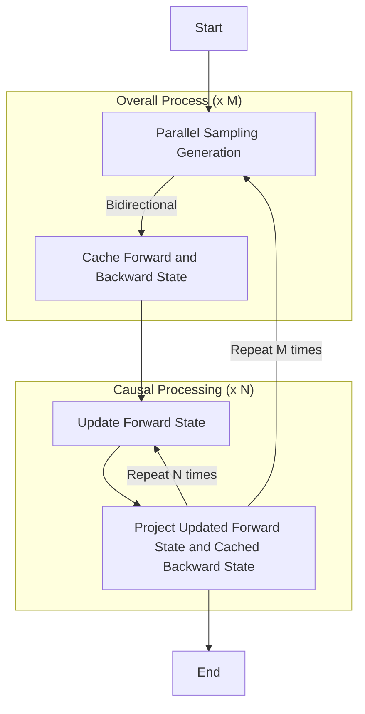

# Hydra Video - A model for efficiently processing video based on Mamba v2

Hydra Video is an extension of the Mamba v2 architecture, specifically designed for efficient video processing. This model introduces a novel approach to handling the unique characteristics of video data, combining the strengths of Mamba v2 with tailored modifications for spatial and temporal dimensions.

## Key features of Hydra Video:

1. Hybrid Directionality:
   - Spatial Dimensions: Utilizes bi-directional modeling, similar to the Hydra architecture.
   - Temporal Dimension: Employs causal (unidirectional) modeling, reflecting the inherent forward progression of time in video sequences.

2. Efficient Processing:
   - Leverages the state space model efficiency of Mamba v2.
   - Adapts the architecture to handle the additional complexities of video data.

3. Intuition-Driven Design:
   - Recognizes that spatial information in videos benefits from bi-directional context.
   - Acknowledges the causal nature of frame progression in the time dimension.

4. Balance of Context and Causality:
   - Allows for rich spatial understanding through bi-directional processing.
   - Maintains temporal coherence and causality in the time dimension.

This approach aims to provide a more nuanced and efficient way of processing video data, potentially leading to improved performance in various video-related tasks such as action recognition, video classification, and temporal event detection.

## Generation
Generation of video can be inherently expensive.  Given the nature of SSMs recurrence which we can take advantage of perhaps this challenge  
can be surmounted.  By using a combination of autoregressive and parallel processing we should be able to lower the bar.

## Todos
- [x] Create hydra video module
- [x] Write unit test for hydra video module
- [x] Write VAE quantizer code
- [ ] Create VQVAE tokenizer built with hydra-video blocks
- [ ] Create video decoder built with hydra-video blocks
- [ ] Create training code for VQVAE Tokenize
- [ ] Create training code for video decoder 
- [ ] Write generation code for parallel sampling and autoregressive generation
